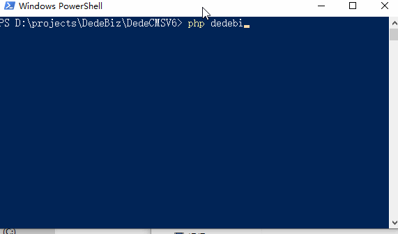

# DedeCMSV6

国内流行的内容管理系统（CMS）多端全媒体解决方案，DedeCMSV6系统基于PHP7.X开发，具有很强的可扩展性，并且完全开放源代码。DedeBIZ商业支持采用现流行的Go语言设计开发，让DedeCMS系统拥有简单易用、灵活扩展特性之外更安全、高效。模板设计制作简单一直是系统的一大特点，全新的版本延续了之前标签引擎，同时采用响应式模板引擎Bootstrap作为系统模板渲染引擎，让搭建跨终端（移动、PC）全媒体站点更简单。

## 版本说明

DedeCMSV6.x是一个LTS版本，支持将到2022年10月截止，目前DedeCMSV6已经发布，可以[点击下载](https://www.dedebiz.com/download)获取。

## 参与开源

访问[代码托管](https://www.dedebiz.com/git)，可以看到我们已经将代码托管在几个知名代码托管平台，可以通过提交Pull requests的方式来贡献您的力量。

## v6.1 Roadmap

我们将会收集、整理新的功能需求制定新的Roadmap。

[开发者](https://www.dedebiz.com/developer)可以到[工单管理](https://www.zhelixie.com/DedeBiz/DedeCMSV6/issues)中进行交流反馈。

普通用户可以通过微信公众号或者邮件的方式进行反馈，详见本页底部资源。

在这里，可以查看版本[更新记录](docs/changelog.md)

## 平台需求

1.Windows 平台

IIS/Apache/Nginx + PHP5/PHP7/PHP8 + MySQL5/8/10

如果在windows环境中使用，建议用DedeCMS提供的DedeAMPZ套件以达到最佳使用性能。

2.Linux/Unix 平台

Apache/Nginx + PHP5/PHP7 + MySQL5/8/10 (PHP必须在非安全模式下运行)

建议使用平台：Linux + Apache2.2 + PHP7.4 + MySQL5.0

3.PHP必须环境或启用的系统函数

CURL：数据采集

GD扩展库：图像验证码、水印、二维码生成

MySQL扩展库：数据存储

OpenSSL：支持DedeBIZ商业支持

Sockets：支持接入DedeBIZ商业组件模块

4.基本目录结构

```
/
..../install     安装程序目录，安装完后可删除[安装时必须有可写入权限]
..../dede        默认后台管理目录（可任意改名）
..../include     类库文件目录[建议关闭对外访问权限]
..../plus        插件扩展程序目录
..../member      会员目录
..../static      静态资源存放目录
..../uploads     默认上传目录[必须可写入]
..../a           默认HTML文件存放目录[必须可写入]
..../templets    系统默认内核模板目录
..../data        系统缓存或其它可写入数据存放目录[必须可写入]
..../special     专题目录[生成一次专题后可以删除special/index.php，必须可写入]
```

5.PHP环境容易碰到的不兼容性问题

  * data目录没写入权限，导致系统session无法使用，这将导致无法登录管理后台（直接表现为验证码不能正常显示）；

  * php的上传的临时文件夹没设置好或没写入权限，这会导致文件上传的功能无法使用；
  
  * 出现莫名的错误，如安装时显示空白，这样能是由于系统没装载mysql扩展导致的，对于初级用户，可以下载dede的php套件包，以方便简单的使用。

## 程序安装使用

1.下载程序解压到本地目录;

2.上传程序目录中的`/src`到网站根目录；

3.运行`http://www.yourname.com/install/index.php`(yourname表示你的域名),按照安装提速说明进行程序安装；

详细安装步骤可以查看[帮助文档](https://www.dedebiz.com/help)

## DedeBIZ命令行工具

在程序包中，我们增加了一个命令行工具`dedebiz`，通过这个命令行工具，我们可以完成例如：静态文件生成、快速搭建开发环境、更新系统等功能。

保证我们系统PATH目录中含有`php`命令，如果是Linux系统，我们可以赋予`dedebiz`文件可执行的权限。

运行`php dedebiz`命令（如果系统中有bash命令行，直接可以执行`./dedebiz`）我们可以看到如下信息：

```
NAME:
	DedeBIZ Cli Tools
USAGE:
	php ./dedebiz command [arguments...]
COMMANDS:
	serv,s Run cli web server for DedeCMSV6
	make,m Make DedeCMSV6 HTML
	update,u Update to latest system
	help,h Shows a list of commands or help
	quick,q Quick start a development environment
WEBSITE:
	https://www.dedebiz.com/help/
```

如果我们想要生成静态文件，可以执行`./dedebiz m o`，便可以自动生成。

除了上面的“程序安装使用”中的步骤，我们也可以通过命令行工具快速开始一个本地开发的站点，执行脚本`./dedebiz q`，就可以快速初始化一个本地开发的站点，非常方便。



## 版权信息

详细参考：[DedeCMSV6站点授权协议](https://www.dedebiz.com/license)

我们对DedeCMSV6系统授权的态度是“鼓励但不强制”，购买授权是对知识产权的尊重，是对我们技术服务的认可。

## 相关资源

- [DedeCMSV6](https://www.dedebiz.com)

- [帮助中心](https://www.dedebiz.com/help)

- [DedeBIZ商业支持](https://www.dedebiz.com)

- [代码托管](https://www.dedebiz.com/git)

- 微信公众号：dedebiz


- 邮箱：support#dedebiz.com
